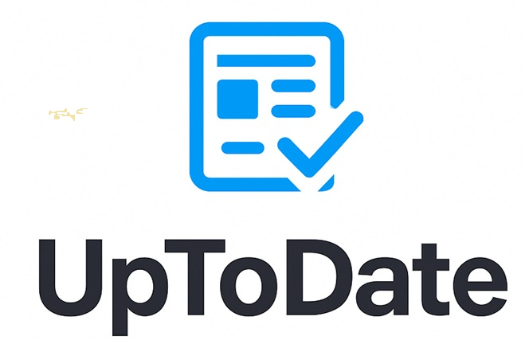

<p align="center">
 
</p>

Welcome to **UpToDate**, your modern news aggregator built with Python!

## Getting Started

### 1. Get Your NewsAPI Key
- Visit [https://newsapi.org/](https://newsapi.org/) and sign up for a free API key.
- Open `newsapi.py` in your editor.
- **Replace** the API key in the first line with your own key:
  ```python
  API_KEY = "your_actual_api_key_here"
  ```

### 2. Download the Required Files
Download and place the following files(all in the folder **UpToDate**) in the **same folder**:
- `main.py`
- `newsapi.py`
- `favorites.py`
- `clean_headlines_moe.py`
- `photo.jpg`
- `logo.png` (your app logo)
- `logo.ico`

### 3. Install Dependencies
Make sure you have the required Python packages installed:
```bash
pip install pillow customtkinter beautifulsoup4 requests tzdata
```

### 4. Run the App
Execute the following command in your terminal(or run it directly):
```bash
python main.py
```

---

Enjoy reading the latest news with **UpToDate**!
